# AI Platform Builder

> An AI-powered, multi-module developer platform where natural language drives live mutations on structured state — running entirely at the Cloudflare edge.


---

## Table of Contents

- [Overview](#overview)
- [Core Pattern](#core-pattern)
- [System Context (C4 Level 1)](#system-context-c4-level-1)
- [Container Diagram (C4 Level 2)](#container-diagram-c4-level-2)
- [Key Interaction Flows](#key-interaction-flows)
  - [Chat → Tool → Preview Flow](#chat--tool--preview-flow)
  - [Agent Stream Lifecycle](#agent-stream-lifecycle)
  - [Multi-Step Agentic Loop](#multi-step-agentic-loop)
  - [RAG Context Injection Flow](#rag-context-injection-flow)
- [Architecture Deep Dive](#architecture-deep-dive)
  - [Frontend Component Hierarchy](#frontend-component-hierarchy)
  - [State Architecture](#state-architecture)
  - [Tool Dispatch Architecture](#tool-dispatch-architecture)
  - [Undo / Redo Architecture](#undo--redo-architecture)
  - [Zod Validation Boundaries](#zod-validation-boundaries)
  - [DSL Token Compression](#dsl-token-compression)
  - [Preview Sandbox Security](#preview-sandbox-security)
- [Monorepo Package Graph](#monorepo-package-graph)
- [Implementation Status](#implementation-status)
- [Module Reference](#module-reference)
- [DSL Examples](#dsl-examples)
- [Technology Stack](#technology-stack)
- [Getting Started](#getting-started)
- [Testing](#testing)
- [Environment Variables](#environment-variables)
- [Architecture Decision Record](#architecture-decision-record)

---

## Overview

AI Platform Builder is a browser-based developer productivity platform. Users describe what they want in plain English; a Cloudflare-edge AI agent executes a sequence of typed tool calls that mutate structured state in the browser. Every mutation is instantly visible via sandboxed live previews.

**8 independent builder modules** — each a complete vertical slice from Zod schema → compact DSL → React UI → agent tools → live preview:

| Module                  | What it builds                                      |
| ----------------------- | --------------------------------------------------- |
| Form Builder            | Typed `FormSchema` → HTML form + React TSX          |
| Layout Builder          | `LayoutNode` tree → Tailwind page layout iframe     |
| API Schema Builder      | `OpenApiSpec` → OpenAPI 3.1 JSON/YAML + Swagger UI  |
| Email Template Builder  | `EmailTemplate` → client-simulated HTML email       |
| DB Schema Builder       | `DbSchema` → SQL / Prisma + Mermaid ERD             |
| Component Story Builder | `StoryFile` → Storybook CSF3 `.stories.tsx`         |
| i18n Manager            | `I18nStore` → multi-language JSON translation files |
| E2E Test Generator      | `TestFile` → Playwright `.spec.ts` + config + POM   |

---

## Core Pattern

The platform implements the **AI Engineering Fundamentals** pattern by Scott Moss:

```
Agent ──► Client-Side Tools ──► Eval Harness ──► Improvement Loop
```

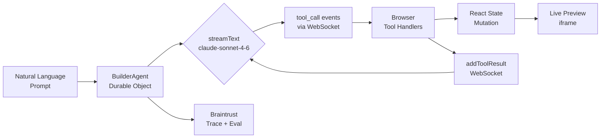

**Key insight:** The agent never executes tools server-side. It emits `tool_call` events and waits. The browser validates, executes, and returns results. This gives zero-latency preview updates with no round-trip serialization cost.

---

## System Context (C4 Level 1)

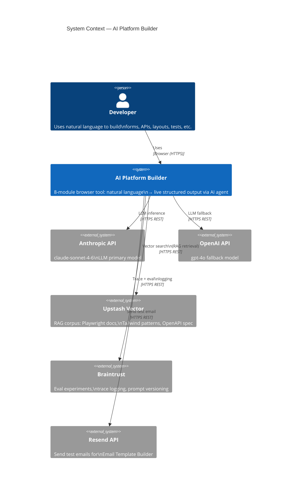

---

## Container Diagram (C4 Level 2)

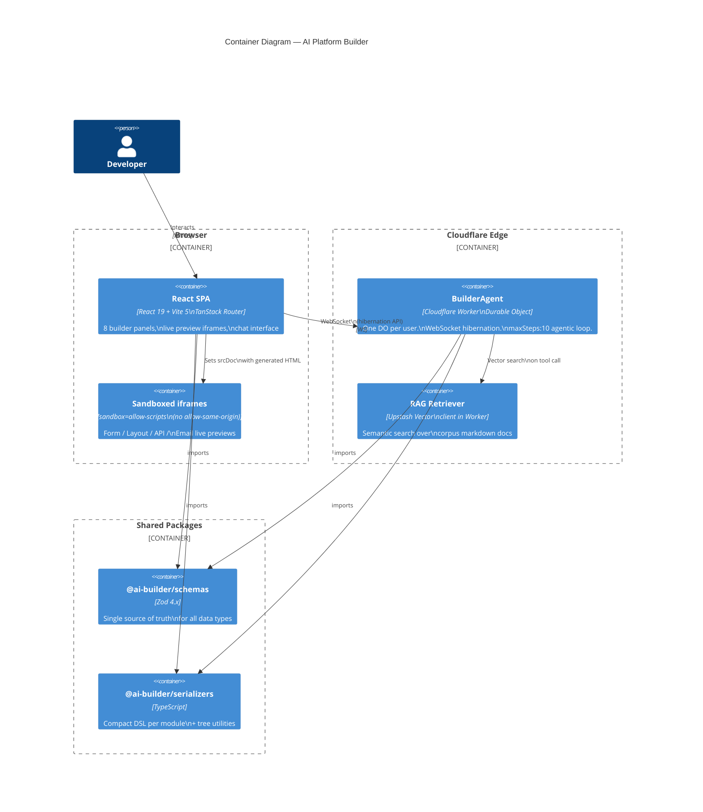

---

## Key Interaction Flows

### Chat → Tool → Preview Flow

This is the primary user interaction: a message travels from the browser through the DO, triggers a tool call, and instantly updates the UI.

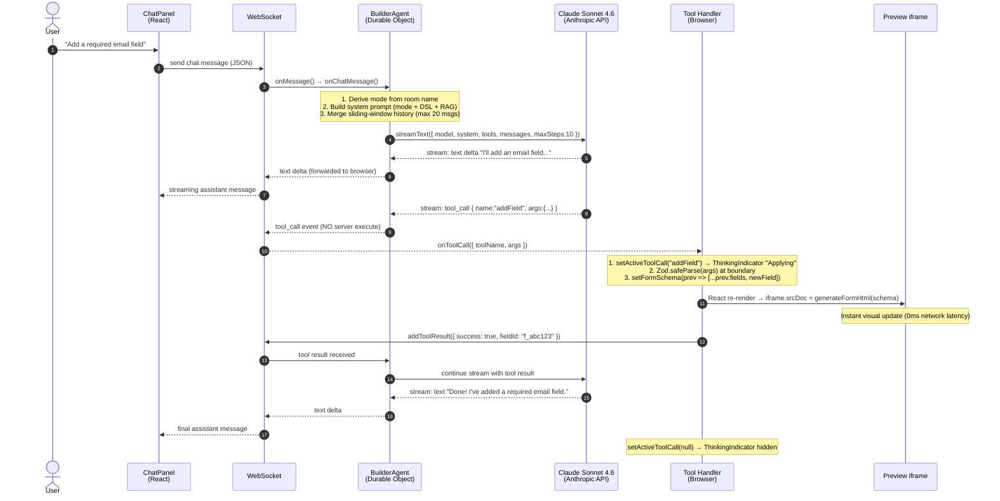

---

### Agent Stream Lifecycle

The `ThinkingIndicator` component reflects the agent's internal state through three distinct phases:

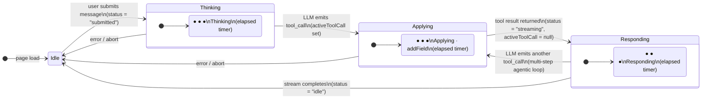

---

### Multi-Step Agentic Loop

The agent runs up to `maxSteps: 10` tool calls before returning to the user. This enables complex multi-step operations ("set the title, add 5 endpoints, then add authentication schemas") in a single prompt:

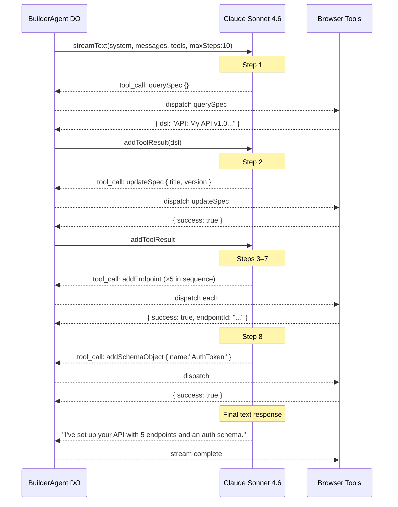

---

### RAG Context Injection Flow

Every prompt includes semantically relevant documentation from an Upstash Vector index:

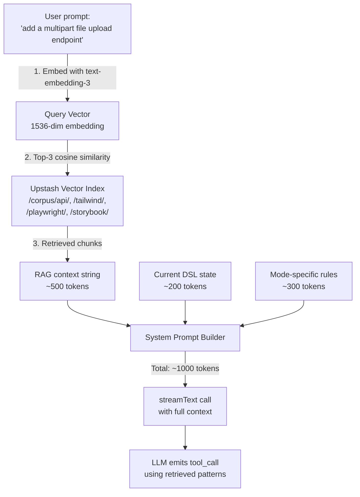

The `retrieveDocs` tool is the **only** server-side tool in the system. All other tools are client-only.

---

## Architecture Deep Dive

### Frontend Component Hierarchy

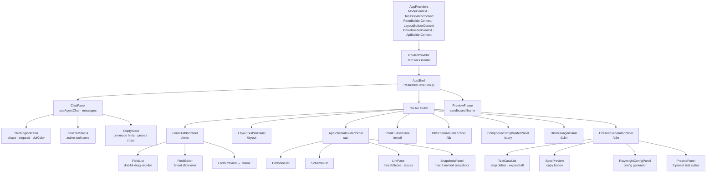

---

### State Architecture

No global state library. Each module owns its state via an isolated React hook. Some modules promote their state to Context so the AppShell can sync the DSL to the agent. State follows a consistent pattern across all 8 modules:

```mermaid
graph LR
    subgraph hook["useModuleState() hook"]
        direction TB
        P[past: State\[\]] --> PRS[present: State]
        PRS --> F[future: State\[\]]
        LS[(localStorage\npersistence)]
        PRS -- useEffect --> LS
        LS -- loadInitial --> PRS
    end

    subgraph ops["Operations"]
        direction TB
        SET["setState(next)\n→ push present to past\n→ clear future"]
        UND["undo()\n→ pop past\n→ push to future"]
        RED["redo()\n→ shift future\n→ push to past"]
        RST["reset()\n→ push present to past\n→ restore default"]
    end

    hook --> MT[useModuleTools\nZod-validated tool handlers]
    MT --> Panel[ModulePanel\nuseRegisterToolDispatch]
```

**History cap:** `MAX_HISTORY = 20` (story, i18n, e2e) or `MAX_HISTORY = 50` (api) — oldest entries are sliced off with `slice(-(MAX_HISTORY - 1))`.

---

### Tool Dispatch Architecture

A single mutable `dispatchRef` routes every tool call to whichever module panel is currently mounted. No re-renders. No stale closures. Safe across route transitions:

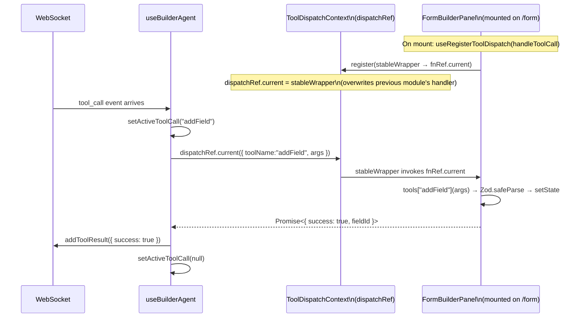

```typescript
// Context value
interface ToolDispatchContextValue {
  dispatchRef: { current: ToolDispatcher };
  register: (fn: ToolDispatcher) => void; // useCallback — stable reference
}

// Registration in each module panel:
function useRegisterToolDispatch(fn: ToolDispatcher): void {
  const { register } = useToolDispatch();
  const fnRef = useRef<ToolDispatcher>(fn);
  fnRef.current = fn; // always current, no re-render trigger

  useEffect(() => {
    // Stable wrapper — fnRef.current is always the latest handler
    register((call) => fnRef.current(call));
  }, [register]); // runs once on mount
}
```

---

### Undo / Redo Architecture

Implemented as two stacks — O(1) push/pop, bounded to `MAX_HISTORY` entries:

```mermaid
stateDiagram-v2
    direction LR

    state "Initial State" as S0 {
        past0: past = []
        present0: present = A
        future0: future = []
    }

    state "After setState(B)" as S1 {
        past1: past = [A]
        present1: present = B
        future1: future = []
    }

    state "After setState(C)" as S2 {
        past2: past = [A, B]
        present2: present = C
        future2: future = []
    }

    state "After undo()" as S3 {
        past3: past = [A]
        present3: present = B
        future3: future = [C]
    }

    state "After redo()" as S4 {
        past4: past = [A, B]
        present4: present = C
        future4: future = []
    }

    S0 --> S1: setState(B)
    S1 --> S2: setState(C)
    S2 --> S3: undo()
    S3 --> S4: redo()
```

---

### Zod Validation Boundaries

There are exactly **three** Zod validation boundaries in the system. Each boundary is a trust gap between two actors:

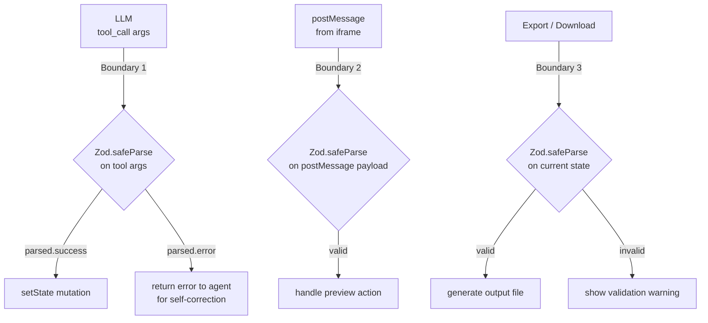

**Critical pattern:** Agent-omitted optional fields must use `.nullable().default(null)` — not just `.nullable()`:

```typescript
// WRONG — agent omits `summary` → Zod throws "Required"
summary: z.string().nullable();

// CORRECT — agent omits `summary` → Zod coerces to null
summary: z.string().nullable().default(null);
```

---

### DSL Token Compression

Each module serializes its state into a hand-crafted compact DSL injected into every system prompt. This is the key mechanism enabling large schemas to fit within a single context window:

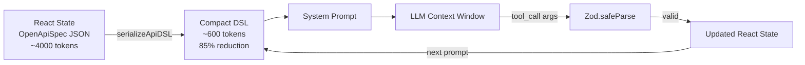

**Token comparison across all 8 modules:**

| Module                   | Raw JSON      | Compact DSL | Reduction |
| ------------------------ | ------------- | ----------- | :-------: |
| Form — 10 fields         | ~2,000 tokens | ~200 tokens |  **90%**  |
| Layout — 20 nodes        | ~3,000 tokens | ~400 tokens |  **87%**  |
| API Spec — 15 routes     | ~4,000 tokens | ~600 tokens |  **85%**  |
| Email — 8 sections       | ~1,500 tokens | ~150 tokens |  **90%**  |
| DB Schema — 6 tables     | ~2,500 tokens | ~350 tokens |  **86%**  |
| Story File — 5 variants  | ~1,200 tokens | ~180 tokens |  **85%**  |
| i18n — 30 keys × 3 langs | ~3,500 tokens | ~400 tokens |  **89%**  |
| E2E — 8 test cases       | ~2,800 tokens | ~350 tokens |  **88%**  |

---

### Preview Sandbox Security

Generated HTML runs in a fully sandboxed iframe. The `allow-same-origin` attribute is intentionally omitted:

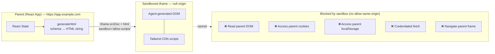

---

## Monorepo Package Graph

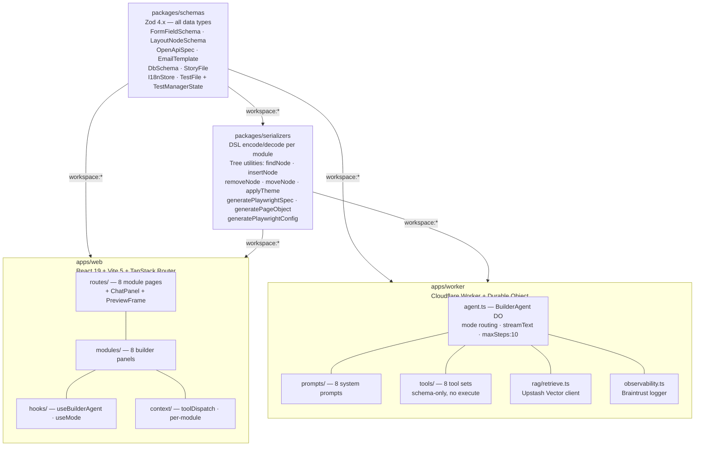

---

## Implementation Status

| Module                      | Schema | DSL | React UI | Tests | Worker Tools | Worker Prompt |
| --------------------------- | :----: | :-: | :------: | :---: | :----------: | :-----------: |
| **Form Builder**            |   ✅   | ✅  |    ✅    |  ✅   |      ✅      |      ✅       |
| **Layout Builder**          |   ✅   | ✅  |    ✅    |  ✅   |      ✅      |      ✅       |
| **API Schema Builder**      |   ✅   | ✅  |    ✅    |  ✅   |      ✅      |      ✅       |
| **Email Template Builder**  |   ✅   | ✅  |    ✅    |  🔲   |      ✅      |      ✅       |
| **DB Schema Builder**       |   ✅   | ✅  |    ✅    |  🔲   |      ✅      |      ✅       |
| **Component Story Builder** |   ✅   | ✅  |    ✅    |  🔲   |      ✅      |      ✅       |
| **i18n Manager**            |   ✅   | ✅  |    ✅    |  🔲   |      ✅      |      ✅       |
| **E2E Test Generator**      |   ✅   | ✅  |    ✅    |  🔲   |      ✅      |      ✅       |
| App Shell / Chat / Routing  |   —    |  —  |    ✅    |  ✅   |      —       |       —       |
| Eval Harness                |   —    |  —  |    —     |   —   |      🔲      |       —       |

✅ Complete · 🔲 Planned

---

## Module Reference

### Form Builder

Generates and edits typed HTML forms from natural language.

**Schema:** `FormField` (13 types) · `ValidationRule` (8 types) → `FormSchema`

**Tools:**

| Tool            | Args                       | Effect                         |
| --------------- | -------------------------- | ------------------------------ |
| `addField`      | `{ field, afterFieldId? }` | Insert Zod-validated field     |
| `removeField`   | `{ fieldId }`              | Delete field by ID             |
| `updateField`   | `{ fieldId, updates }`     | Partial field update           |
| `reorderFields` | `{ orderedIds }`           | Reorder all fields by ID array |
| `querySchema`   | —                          | Return compact DSL string      |

**Field types:** `text · email · password · number · tel · textarea · select · multiselect · checkbox · radio · date · file · hidden`

**Exports:** JSON Schema · React TSX (react-hook-form) · Semantic HTML

---

### Layout Builder

Builds Tailwind CSS page layouts as a typed recursive `LayoutNode` tree.

**Schema:** `LayoutNode` (16 types, `z.lazy` recursive) · `LayoutTree`

**Tools:**

| Tool                 | Args                                   | Effect                    |
| -------------------- | -------------------------------------- | ------------------------- |
| `addComponent`       | `{ node, parentId?, afterSiblingId? }` | Insert Zod-validated node |
| `removeComponent`    | `{ nodeId }`                           | Remove node + subtree     |
| `updateClasses`      | `{ nodeId, classes, mode }`            | replace / merge / remove  |
| `updateContent`      | `{ nodeId, content }`                  | Update text content       |
| `nestComponent`      | `{ nodeId, newParentId }`              | Move node to new parent   |
| `reorderComponents`  | `{ parentId, orderedIds }`             | Reorder children          |
| `duplicateComponent` | `{ nodeId }`                           | Clone at same level       |
| `applyTheme`         | `{ colorScheme?, accentColor? }`       | Walk tree, apply theme    |
| `queryLayout`        | —                                      | Return compact DSL string |

**Exports:** HTML (Tailwind CDN) · React JSX · JSON

---

### API Schema Builder

Builds OpenAPI 3.1 specifications. Includes undo/redo, named snapshots, built-in linter, and 7 export formats.

**Schema:** `OpenApiSpec` · `ApiEndpoint` · `ApiSchemaObject` · `SecurityScheme`

**Tools:** `querySpec · updateSpec · addEndpoint · removeEndpoint · updateEndpoint · reorderEndpoints · setRequestBody · addSchemaObject · updateSchemaObject · removeSchemaObject · addTag · removeTag · generateMockData · retrieveDocs`

**Built-in linter (8 rules, 3 severity levels):**

| Rule                               | Level   |
| ---------------------------------- | ------- |
| Duplicate method + path            | error   |
| GET by-ID without 404 response     | warning |
| Non-kebab-case path segment        | warning |
| Missing summary                    | warning |
| POST/PUT/PATCH without requestBody | info    |
| Mutating endpoint without auth     | info    |
| No 5xx response defined            | info    |
| Tag used but not defined           | warning |

Health score = `100 - (errors × 20) - (warnings × 5) - (infos × 1)`, clamped 0–100.

**Exports:** OpenAPI JSON · OpenAPI YAML · Postman Collection · DSL · TypeScript SDK · cURL Script · Python SDK

---

### Email Template Builder

Builds responsive HTML email templates section by section. Simulates 4 email clients.

**Schema:** `EmailSection` (discriminated union, 8 types) → `EmailTemplate`

**Tools:** `queryTemplate · updateSubject · addSection · updateSection · removeSection · reorderSections · setClientMode · clearTemplate`

**Client previews:** Desktop · Mobile · Outlook (MSO tables) · Dark mode (CSS injection)

**Exports:** HTML · DSL · JSON

---

### Component Story Builder

Generates Storybook CSF3 `.stories.tsx` files with multi-file management.

**Schema:** `StoryFile` (variants · argTypes · decorators · tags) → `StoryManagerState`

**Tools:** `queryStory · setComponent · addVariant · updateVariant · removeVariant · addArgType · removeArgType · addDecorator · addTag · createStoryFile · switchStoryFile · removeStoryFile`

**Features:** Undo/redo · localStorage persist · 5 presets · 8 decorator presets · import from `.stories.tsx` · 4-tab UI (Variants / Controls / Preview / Code)

---

### i18n Manager

Manages translation keys across multiple locales with namespace support.

**Schema:** `I18nKey` · `I18nNamespace` · `I18nStore` · `I18nManagerState` (multi-locale)

**Tools:** `queryStore · addLanguage · removeLanguage · addKey · updateTranslation · removeKey · addNamespace`

**Features:** Missing translation detection · namespace organisation · import from JSON · multi-file export

---

### E2E Test Generator

Generates Playwright `.spec.ts` test files with full multi-file management.

**Schema:** `TestStep` (13 action types) · `TestCase` (+ `beforeEach`) · `TestFile` → `TestManagerState`

**Step types:** `navigate · click · fill · select · check · hover · press · upload · scroll · wait · screenshot · axe · expect`

**Expect types:** `visible · hidden · text · url · count · value · attribute · enabled · disabled · checked`

**Tools:** `querySpec · setFileInfo · addTestCase · updateTestCase · removeTestCase · duplicateTestCase · addStep · updateStep · removeStep · reorderSteps · addBeforeEachStep · reorderTestCases · createTestFile · switchTestFile · removeTestFile · retrieveDocs`

**Features:** Undo/redo · localStorage persist · 5 preset test suites · expand-all/collapse-all · per-step delete · 3-tab UI (Tests / Code / Config)

**Exports:** `.spec.ts` · Page Object Model class · `playwright.config.ts` · DSL · JSON

---

## DSL Examples

### API DSL

```
API: Product API v1.0.0 | baseUrl:https://api.example.com | auth:BearerJWT

TAGS: products(Product catalog), orders(Order management)

GET     /products          → 200:Product[], 500:ServerError
POST    /products          → 201:Product, 400:ValidationError  [body:CreateProductInput] [auth]
GET     /products/{id}     → 200:Product, 404:NotFound
PUT     /products/{id}     → 200:Product, 404:NotFound  [body:UpdateProductInput] [auth]
DELETE  /products/{id}     → 204:NoContent, 404:NotFound  [auth]

SCHEMA Product
  id!: string
  name!: string
  price!: number
  category: string
```

### Email DSL

```
EMAIL: Welcome Campaign | subject:Welcome to {{company}}!
header | bg:#1a1a2e
  logo | src:{{logoUrl}} | alt:Logo | width:120
hero | headline:Welcome, {{firstName}}! | sub:You're in.
text | Let's get you set up in under 5 minutes.
button | label:Get Started | href:{{ctaUrl}} | bg:#6366f1
footer | company:{{company}} | year:2026
```

### Storybook DSL

```
STORY: Button | path:src/components/Button.tsx | layout:centered
TAGS: autodocs
ARGTYPE: label | text | default:"Click me"
ARGTYPE: variant | select | opts:primary,secondary,danger | default:primary
ARGTYPE: disabled | boolean | default:false
VARIANT: Primary | label:"Click me" | variant:primary
VARIANT: Disabled | label:"Click me" | disabled:true
DECORATOR: ThemeProvider
```

### E2E DSL

```
FILE: auth.spec.ts | url:http://localhost:3000
DESCRIBE: Authentication flows

TEST: User can log in with valid credentials [smoke,auth]
  NAVIGATE /login
  FILL [label="Email"] → "user@example.com"
  FILL [label="Password"] → "password123"
  CLICK [role="button"]
  EXPECT url "/dashboard"

TEST: User sees error with invalid credentials [auth]
  NAVIGATE /login
  FILL [label="Email"] → "wrong@example.com"
  FILL [label="Password"] → "wrongpass"
  CLICK [role="button"]
  EXPECT [text="Invalid credentials"] visible
```

### i18n DSL

```
STORE: 3 langs | en(default) · pl · de | 2 namespaces

NS: common
  KEY: app.title
    en: "AI Platform Builder"
    pl: "Konstruktor Platformy AI"
    de: "KI-Plattform-Builder"
  KEY: nav.login
    en: "Sign in"
    pl: "Zaloguj się"
    de: "Anmelden"

NS: auth
  KEY: login.email
    en: "Email address"
    pl: "Adres e-mail"
    de: "E-Mail-Adresse"
  KEY: login.submit
    en: "Sign in"
    pl: "Zaloguj"
    de: ⚠ MISSING
```

---

## Technology Stack

### Frontend

| Concern       | Technology             | Version | Notes                                      |
| ------------- | ---------------------- | ------- | ------------------------------------------ |
| Framework     | React                  | 19.x    | Concurrent features, strict mode           |
| Build         | Vite                   | 5.x     | Fast HMR, native ESM                       |
| Language      | TypeScript             | 5.x     | `strict: true`, zero `any`                 |
| Routing       | TanStack Router        | 1.x     | File-based, fully type-safe                |
| Styling       | Tailwind CSS           | 4.x     | Also the _output target_ of Layout Builder |
| Components    | shadcn/ui              | latest  | new-york style, neutral base               |
| Layout panels | react-resizable-panels | —       | 3-panel: Chat / Builder / Preview          |
| Drag & drop   | @dnd-kit               | 6.x     | Form fields + email sections               |
| ID generation | nanoid                 | 5.x     | `ep_abc123`, `f_xyz789`, `tc_def456`       |
| Markdown      | react-markdown         | —       | Assistant responses                        |

### Backend & Agent

| Concern           | Technology          | Notes                                                |
| ----------------- | ------------------- | ---------------------------------------------------- |
| Runtime           | Cloudflare Workers  | V8 isolates, globally distributed at edge            |
| Stateful sessions | Durable Objects     | One DO per user, WebSocket hibernation               |
| Agent SDK         | @cloudflare/ai-chat | `AIChatAgent` base class, `useAgentChat`             |
| AI SDK            | Vercel AI SDK 4.x   | `streamText`, `tool`, `maxSteps`                     |
| LLM primary       | Claude Sonnet 4.6   | Best tool-calling; used when `ANTHROPIC_API_KEY` set |
| LLM fallback      | OpenAI GPT-4o       | When only `OPENAI_API_KEY` is available              |
| Embeddings        | text-embedding-3    | 1536-dim, Upstash Vector indexing                    |

### Data & Validation

| Concern             | Technology     | Notes                                           |
| ------------------- | -------------- | ----------------------------------------------- |
| Schema validation   | Zod 4.x        | Types + runtime guards + tool params + exports  |
| Vector DB           | Upstash Vector | Serverless HTTP REST (CF Workers compatible)    |
| Context compression | Custom DSL     | 85–90% token reduction vs raw JSON              |
| Persistence         | localStorage   | Per-module state + named snapshots (max 5)      |
| Email delivery      | Resend API     | Send-test endpoint, Vite proxies `/api` → :8787 |

### Quality & Infrastructure

| Concern        | Technology            | Notes                                                     |
| -------------- | --------------------- | --------------------------------------------------------- |
| Unit tests     | Vitest 2.x            | jsdom, @testing-library/react, 161 passing                |
| Evals          | Braintrust            | Experiments, traces, prompt versioning                    |
| Linting        | ESLint 9              | Flat config, typescript-eslint strict, `--max-warnings=0` |
| Formatting     | Prettier 3            | `prettier-plugin-tailwindcss`                             |
| Git hooks      | Husky + lint-staged   | Pre-commit: ESLint · Pre-push: `tsc --noEmit`             |
| Commits        | Commitlint            | Conventional commits                                      |
| Monorepo       | pnpm workspaces       | `workspace:*` linking, single lockfile                    |
| Build pipeline | Turborepo 2.x         | Cached builds, parallel tasks, dependency-ordered         |
| CI/CD          | GitHub Actions        | PR: lint → type-check → test → build                      |
| Deployment     | Cloudflare Pages + DO | Automated on merge to `main`                              |

---

## Getting Started

### Prerequisites

- Node.js 20+
- pnpm 9+ (`npm i -g pnpm`)
- Cloudflare account (for worker deployment)

### Install

```bash
git clone https://github.com/your-org/ai-platform-builder.git
cd ai-platform-builder
pnpm install
```

### Development

```bash
# Frontend only (localhost:5173) — uses mock agent responses
pnpm --filter @ai-builder/web dev

# Worker (Miniflare at localhost:8787)
pnpm --filter @ai-builder/worker dev

# Both concurrently (Vite proxies /api and /agents/* → :8787)
pnpm dev
```

### Build

```bash
# All packages — Turborepo resolves dependency order and uses build cache
pnpm build

# Single package
pnpm --filter @ai-builder/web build
pnpm --filter @ai-builder/schemas build
pnpm --filter @ai-builder/serializers build
```

### Deploy

```bash
# Set worker secrets
wrangler secret put ANTHROPIC_API_KEY
wrangler secret put UPSTASH_URL
wrangler secret put UPSTASH_TOKEN
wrangler secret put BRAINTRUST_API_KEY
wrangler secret put RESEND_API_KEY

# Deploy worker
pnpm --filter @ai-builder/worker deploy

# Deploy frontend (Cloudflare Pages — or set up via GitHub integration)
pnpm --filter @ai-builder/web build
```

---

## Testing

**161 passing tests** across schemas, serializers, and the React app.

```bash
# Full test suite
pnpm test

# Per package
pnpm --filter @ai-builder/schemas test
pnpm --filter @ai-builder/serializers test
pnpm --filter @ai-builder/web test

# Watch mode
pnpm --filter @ai-builder/web exec vitest

# Type check (pre-push gate)
pnpm type-check

# Lint (pre-commit gate, zero warnings allowed)
pnpm lint
```

### Test Coverage by File

| Package                   | File                       |   Tests |
| ------------------------- | -------------------------- | ------: |
| `@ai-builder/schemas`     | `form.test.ts`             |      13 |
| `@ai-builder/schemas`     | `layout.test.ts`           |      16 |
| `@ai-builder/serializers` | `form-dsl.test.ts`         |      10 |
| `@ai-builder/serializers` | `layout-dsl.test.ts`       |      25 |
| `@ai-builder/web`         | `cn.test.ts`               |       6 |
| `@ai-builder/web`         | `EmptyState.test.tsx`      |       4 |
| `@ai-builder/web`         | `ErrorBoundary.test.tsx`   |       3 |
| `@ai-builder/web`         | `useMode.test.tsx`         |       4 |
| `@ai-builder/web`         | `useBuilderAgent.test.tsx` |       7 |
| `@ai-builder/web`         | `useFormTools.test.ts`     |       7 |
| `@ai-builder/web`         | `useLayoutState.test.ts`   |       8 |
| `@ai-builder/web`         | `useLayoutTools.test.ts`   |      17 |
| `@ai-builder/web`         | `ModeSwitcher.test.tsx`    |       3 |
| `@ai-builder/web`         | `ChatPanel.test.tsx`       |      10 |
| `@ai-builder/web`         | `ToolCallStatus.test.tsx`  |       2 |
| `@ai-builder/web`         | `useApiState.test.ts`      |      19 |
| `@ai-builder/web`         | `useApiTools.test.ts`      |      32 |
| `@ai-builder/web`         | `lint.test.ts`             |      28 |
| **Total**                 |                            | **161** |

---

## Environment Variables

| Variable             | App    | How to set      | Description                               |
| -------------------- | ------ | --------------- | ----------------------------------------- |
| `VITE_AGENT_URL`     | web    | `.env.local`    | WebSocket URL for the Durable Object      |
| `ANTHROPIC_API_KEY`  | worker | Wrangler secret | Claude Sonnet 4.6 (primary LLM)           |
| `OPENAI_API_KEY`     | worker | Wrangler secret | GPT-4o (fallback if Anthropic key absent) |
| `UPSTASH_URL`        | worker | Wrangler secret | Upstash Vector REST endpoint              |
| `UPSTASH_TOKEN`      | worker | Wrangler secret | Upstash auth token                        |
| `BRAINTRUST_API_KEY` | worker | Wrangler secret | Eval tracking + trace logging             |
| `RESEND_API_KEY`     | worker | Wrangler secret | Email send-test (Email Template Builder)  |

---

## Architecture Decision Record

| #   | Decision                    | Choice                                              | Rationale                                                                                                      |
| --- | --------------------------- | --------------------------------------------------- | -------------------------------------------------------------------------------------------------------------- |
| 1   | **Agent runtime**           | Cloudflare Durable Objects                          | One stateful session per user, globally distributed, WebSocket hibernation — CPU cost = 0 between frames       |
| 2   | **Tool execution location** | Client-side only (no `execute`)                     | Zero-latency preview updates; state stays in React; no round-trip serialization for large schemas              |
| 3   | **Context compression**     | Custom compact DSL per module                       | 85–90% token reduction vs raw JSON; fits multi-field specs in a single context window                          |
| 4   | **Schema validation**       | Zod everywhere with `.nullable().default(null)`     | Single schema → types + guards + tool params. `.default(null)` is critical: agent-omitted fields must not fail |
| 5   | **Preview isolation**       | `sandbox="allow-scripts"` (no `allow-same-origin`)  | Agent-generated HTML cannot access parent origin, cookies, or localStorage                                     |
| 6   | **Conversation history**    | Sliding window (max 20 messages)                    | Prevents unbounded context growth; DSL re-injected per message provides fresh state without replay             |
| 7   | **Primary LLM**             | Claude Sonnet 4.6 with GPT-4o fallback              | Claude's superior tool-calling and instruction-following; fallback ensures deployability without Anthropic key |
| 8   | **State management**        | Local React state + Context (no Redux/Zustand)      | Each module is isolated; no cross-module state; Context is sufficient; no additional bundle weight             |
| 9   | **Tool dispatcher**         | Single mutable ref via Context                      | No re-renders on register; always points to the mounted module's handler; safe across route transitions        |
| 10  | **Monorepo tooling**        | pnpm workspaces + Turborepo                         | Hard-linked installs, cached builds, incremental pipelines — `pnpm build` orders automatically                 |
| 11  | **Undo/redo**               | `past[]` / `future[]` arrays, `MAX_HISTORY = 20-50` | O(1) push/pop, bounded memory, no external library needed                                                      |
| 12  | **Multi-file state**        | `ManagerState = { files[], activeFileId }`          | Story Builder, i18n, E2E all need multiple output files; consistent pattern across all three                   |
| 13  | **Step IDs in E2E schema**  | Every `TestStep` has a stable `id`                  | Enables ID-based removal and update (`removeStep`, `updateStep`) instead of fragile index-based mutation       |
| 14  | **Agentic loop limit**      | `maxSteps: 10`                                      | Allows complex multi-tool sequences (e.g., set file + add 8 test cases + reorder) without infinite loops       |
